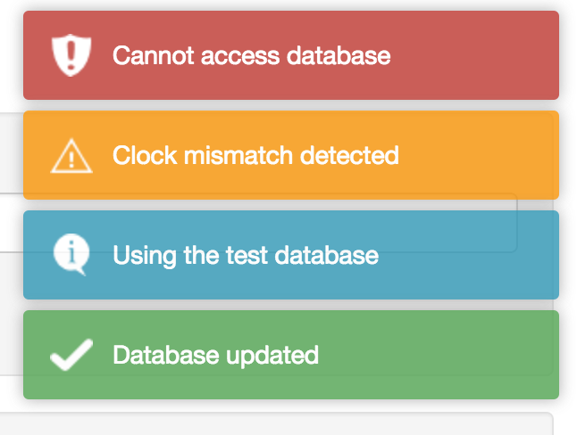

# shinytoastr

> Notifications in Shiny, via [toastr](https://github.com/CodeSeven/toastr)

[](http://www.repostatus.org/#active)
[](https://travis-ci.org/MangoTheCat/shinytoastr)
[](https://ci.appveyor.com/project/gaborcsardi/shinytoastr)
[](http://www.r-pkg.org/pkg/shinytoastr)
[](http://www.r-pkg.org/pkg/shinytoastr)

<h1 align="center">
    
</h1>

## Installation

```r
source("https://install-github.me/mangothecat/shinytoastr")
```

## Usage

Call `useToastr()` at the beginning of `ui` definition, and then
in the `server` definition use one of the notification functions,
`toastr_success()`, `toastr_info()`, `toastr_warning()` or
`toastr_error()` to create notifications:

```r
library(shinytoastr)

ui <- shinyUI(fluidPage(
  useToastr(),
  pageWithSidebar(
    headerPanel("Header"),
    sidebarPanel(
	  ...
      actionButton(inputId = "save_button", label = "Save",
	                class = "btn-primary")
      ...
    ),
    mainPanel(
      ...
    )
  )
))
```

```r
server <- function(input, output, session) {
  ...
  observeEvent(
    input$save_button,
    {
      tryCatch(
        {
          writeToDB(data)
          toastr_success("Saved to database")
        },
        error = function(e) {
          toastr_error(title = "Database error", conditionMessage(e))
        }
      }
    }
  )
}
```

## License

MIT © John Papa, Tim Ferrell, Hans Fjällemark,
[Mango Solutions](https://github.com/mangothecat).
